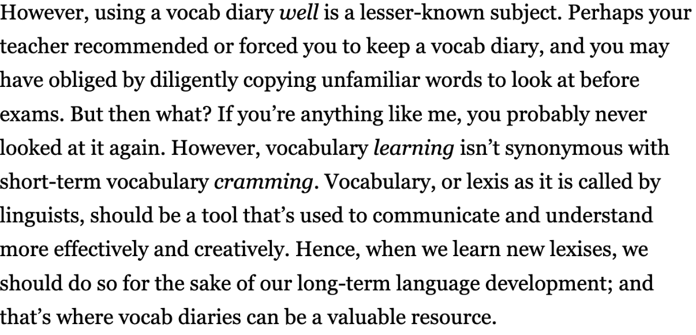

# The Magic of Vocabulary Diaries

## 배운 것

- [x] 암기 20분
- have obliged by를 입 밖으로 내뱉은 적이 오랜만이다.
- Hence, Perhaps, However 접속사를 오랜만에 사용한다.
- for the sake of 내 언어로 익혀두기

## 출처

https://www.ringleplus.com/ko/student/portal/materials/2319
