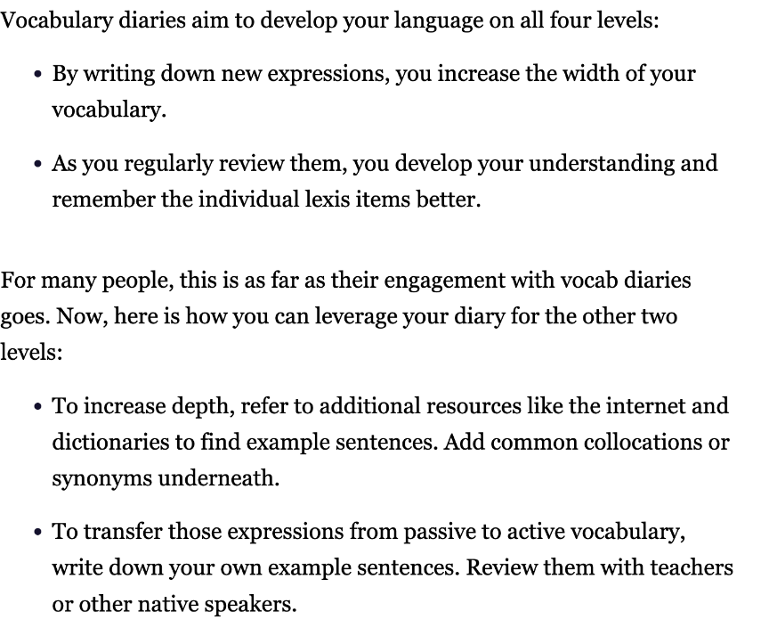

# The Magic of Vocabulary Diaries

## 배운 것

- [x] 암기 25분
- furthermore은 이런 느낌으로 사용하는구나!!

1. your knowledge of lexis has two dimenstion : width and depth
2. width describes the general amount of expression you know.
3. depth on the other hand, describes how well you understand their nuances and situational usage (i e in what situations they can be used, their level of formality, common collocatios, cultural connotations, etc).
4. Furthermore, we distinguish between two kinds of lexis knowledge application.
5. One is understanding lexis(passive vocabulary), and the other is knowing how to use it (active vocabulary)

## 상황

현재 시각 7시 정말 피곤한 상황에서 암기하고 퇴근한다. 1년동안 한번 가보자!! (우선 한달이라도)

## 출처

https://www.ringleplus.com/ko/student/portal/materials/2319
